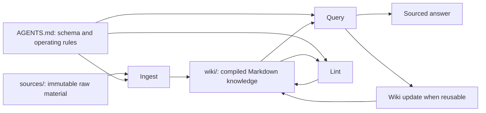

# LLM Wiki Pattern

## Summary

The LLM Wiki pattern is a knowledge-management architecture where an LLM incrementally compiles raw material into a persistent, interlinked Markdown wiki. The wiki becomes the working memory layer for future questions, decisions, and synthesis.

Source: [Karpathy LLM Wiki source note](../../sources/notes/karpathy-llm-wiki-source-note.md)

## Key Ideas

- Raw sources remain the source of truth.
- The wiki is maintained by the LLM, with human review and corrections.
- The wiki should synthesize knowledge, not merely mirror documents.
- Querying starts from the wiki before falling back to raw sources.
- Maintenance is part of the loop: stale, duplicate, and unsourced pages are cleaned over time.
- `index.md` catalogs pages by category; `log.md` records chronological operations.
- Open Knowledge Format (OKF) shows how Markdown bundles can make provenance, trust, lifecycle, and reproducible computation explicit without requiring a runtime.

## Architecture

## When It Helps

- Long-lived projects where context needs to survive many sessions.
- Research workflows with recurring questions.
- Team or personal knowledge bases where decisions need provenance.
- Agent workflows that need stable memory without relying only on vector search.

## Risks

- Hallucinated claims can become persistent if they are not sourced.
- Poor page boundaries can create duplicate or conflicting knowledge.
- The wiki can drift from raw sources if linting is skipped.
- Overly broad pages become hard for future agents to update safely.

Synthesis: [Balanced Citation Policy](../decisions/balanced-citation-policy.md) mitigates sourcing risks without blocking cross-page synthesis.

Synthesis: [Open Knowledge Format](./open-knowledge-format.md) provides a compatible metadata vocabulary for making source lineage, verification, freshness, and computation contracts more machine-readable.

## Related

- [Karpathy LLM Wiki Gist](../entities/karpathy-llm-wiki-gist.md)
- [Open Knowledge Format](./open-knowledge-format.md)
- [Balanced Citation Policy](../decisions/balanced-citation-policy.md)
- [Ingest Workflow](../operations/ingest.md)
- [Query Workflow](../operations/query.md)
- [Lint Workflow](../operations/lint.md)
- [Wiki log](../log.md)
